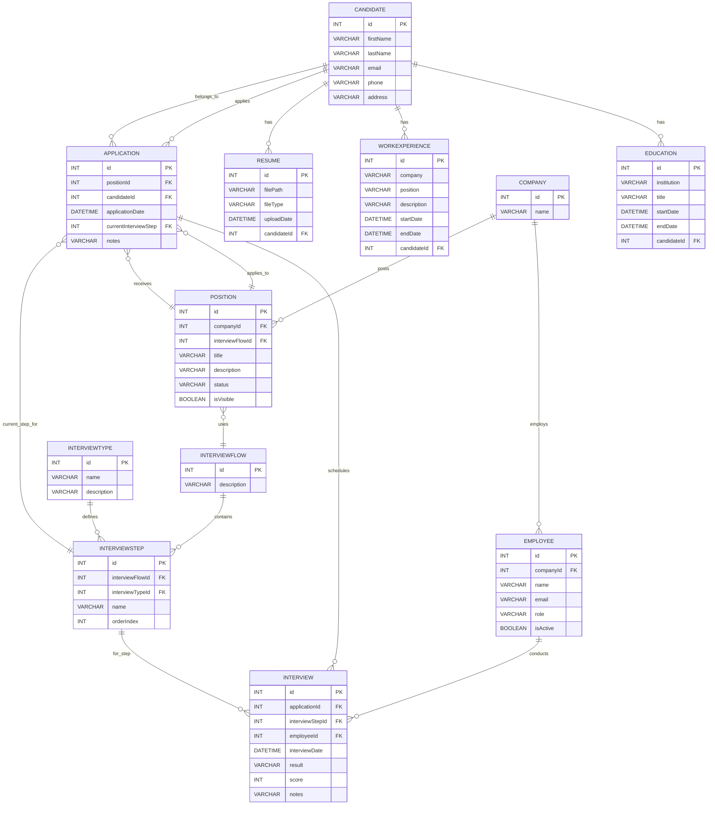

# Database documentation — Prisma schema

This document summarizes the database models defined in `schema.prisma` (fields, types and relationships) and includes a Mermaid ER diagram.

Source: `backend/prisma/schema.prisma`

## Models and fields

- **Candidate**
  - id: Int (PK, autoincrement)
  - firstName: String (varchar(100))
  - lastName: String (varchar(100))
  - email: String (unique, varchar(255))
  - phone: String? (varchar(15))
  - address: String? (varchar(100))
  - Relations: educations[], workExperiences[], resumes[], applications[]

- **Education**
  - id: Int (PK)
  - institution: String (varchar(100))
  - title: String (varchar(250))
  - startDate: DateTime
  - endDate: DateTime?
  - candidateId: Int (FK -> Candidate.id)

- **WorkExperience**
  - id: Int (PK)
  - company: String (varchar(100))
  - position: String (varchar(100))
  - description: String? (varchar(200))
  - startDate: DateTime
  - endDate: DateTime?
  - candidateId: Int (FK -> Candidate.id)

- **Resume**
  - id: Int (PK)
  - filePath: String (varchar(500))
  - fileType: String (varchar(50))
  - uploadDate: DateTime
  - candidateId: Int (FK -> Candidate.id)

- **Company**
  - id: Int (PK)
  - name: String (unique)
  - Relations: employees[], positions[]

- **Employee**
  - id: Int (PK)
  - companyId: Int (FK -> Company.id)
  - name: String
  - email: String (unique)
  - role: String
  - isActive: Boolean (default: true)
  - Relations: interviews[]

- **InterviewType**
  - id: Int (PK)
  - name: String
  - description: String?
  - Relations: interviewSteps[]

- **InterviewFlow**
  - id: Int (PK)
  - description: String?
  - Relations: interviewSteps[], positions[]

- **InterviewStep**
  - id: Int (PK)
  - interviewFlowId: Int (FK -> InterviewFlow.id)
  - interviewTypeId: Int (FK -> InterviewType.id)
  - name: String
  - orderIndex: Int
  - Relations: applications[], interviews[]

- **Position**
  - id: Int (PK)
  - companyId: Int (FK -> Company.id)
  - interviewFlowId: Int (FK -> InterviewFlow.id)
  - title: String
  - description: String
  - status: String (default: "Draft")
  - isVisible: Boolean (default: false)
  - location: String
  - jobDescription: String
  - requirements: String?
  - responsibilities: String?
  - salaryMin: Float?
  - salaryMax: Float?
  - employmentType: String?
  - benefits: String?
  - companyDescription: String?
  - applicationDeadline: DateTime?
  - contactInfo: String?
  - Relations: applications[]

- **Application**
  - id: Int (PK)
  - positionId: Int (FK -> Position.id)
  - candidateId: Int (FK -> Candidate.id)
  - applicationDate: DateTime
  - currentInterviewStep: Int (FK -> InterviewStep.id)
  - notes: String?
  - Relations: position, candidate, interviewStep, interviews[]

- **Interview**
  - id: Int (PK)
  - applicationId: Int (FK -> Application.id)
  - interviewStepId: Int (FK -> InterviewStep.id)
  - employeeId: Int (FK -> Employee.id)
  - interviewDate: DateTime
  - result: String?
  - score: Int?
  - notes: String?

## Relationship summary

- Candidate 1 — * Education (one candidate has many educations)
- Candidate 1 — * WorkExperience
- Candidate 1 — * Resume
- Candidate 1 — * Application
- Company 1 — * Employee
- Company 1 — * Position
- Position 1 — * Application
- Position * — 1 InterviewFlow (each position references an interview flow)
- InterviewFlow 1 — * InterviewStep
- InterviewType 1 — * InterviewStep
- InterviewStep 1 — * Interview (an interview step may have many interviews associated)
- InterviewStep 1 — * Application (applications reference a currentInterviewStep)
- Application 1 — * Interview (an application can have multiple interviews)
- Employee 1 — * Interview (an employee may conduct many interviews)

## Mermaid ER diagram

## Notes and recommendations (DBA)

- Indexes: ensure indexes on frequently queried fields such as `Candidate.email` (already unique), `Employee.email` (unique) and FK fields (`candidateId`, `positionId`, `applicationId`) for join performance.
- Constraints: Prisma enforces FK constraints; review cascade behaviors on deletes (default behavior depends on schema & DB migrations). Decide whether to use `ON DELETE CASCADE` for children like educations/resumes when a candidate is deleted.
- Dates: all DateTime fields should be stored in UTC. Ensure application/ORM timezone handling is consistent.
- Growth: large `resumes.filePath` column allows up to 500 chars; if storing many files consider using object storage (S3) and keeping only a reference.
- Migrations: keep a migration history and run `prisma migrate dev` / `prisma migrate deploy` according to environment.

---

Generated from `schema.prisma` on the project.

